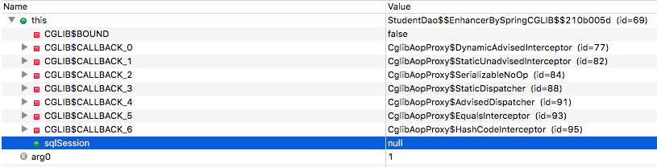
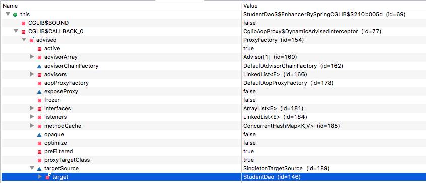

## 写在前面

这个demo来说明怎么排查一个`@Transactional`引起的`NullPointerException`。

## 定位 NullPointerException 的代码

Demo是一个简单的spring事务例子，提供了下面一个`StudentDao`，并用`@Transactional`来声明事务：

```java
@Component
@Transactional
public class StudentDao {

	@Autowired
	private SqlSession sqlSession;

	public Student selectStudentById(long id) {
		return sqlSession.selectOne("selectStudentById", id);
	}

	public final Student finalSelectStudentById(long id) {
		return sqlSession.selectOne("selectStudentById", id);
	}
}
```

应用启动后，会依次调用`selectStudentById`和`finalSelectStudentById`：

```java
	@PostConstruct
	public void init() {
		studentDao.selectStudentById(1);
		studentDao.finalSelectStudentById(1);
	}
```

用`mvn spring-boot:run` 或者把工程导入IDE里启动，抛出来的异常信息是：


```
Caused by: java.lang.NullPointerException
	at sample.mybatis.dao.StudentDao.finalSelectStudentById(StudentDao.java:27)
	at com.example.demo.transactional.nullpointerexception.DemoNullPointerExceptionApplication.init(DemoNullPointerExceptionApplication.java:30)
	at sun.reflect.NativeMethodAccessorImpl.invoke0(Native Method)
	at sun.reflect.NativeMethodAccessorImpl.invoke(NativeMethodAccessorImpl.java:62)
	at sun.reflect.DelegatingMethodAccessorImpl.invoke(DelegatingMethodAccessorImpl.java:43)
	at java.lang.reflect.Method.invoke(Method.java:498)
	at org.springframework.beans.factory.annotation.InitDestroyAnnotationBeanPostProcessor$LifecycleElement.invoke(InitDestroyAnnotationBeanPostProcessor.java:366)
	at org.springframework.beans.factory.annotation.InitDestroyAnnotationBeanPostProcessor$LifecycleMetadata.invokeInitMethods(InitDestroyAnnotationBeanPostProcessor.java:311)
```


为什么应用代码里执行`selectStudentById`没有问题，而执行`finalSelectStudentById`就抛出`NullPointerException`?

同一个bean里，明明`SqlSession sqlSession`已经被注入了，在``selectStudentById``里它是非null的。为什么`finalSelectStudentById`函数里是null？

## 获取实际运行时的类名

当然，我们对比两个函数，可以知道是因为`finalSelectStudentById`的修饰符是`final`。但是具体原因是什么呢？

我们先在抛出异常的地方打上断点，调试代码，获取到具体运行时的`class`是什么：

```java
System.err.println(studentDao.getClass());
```

打印的结果是：

```
class sample.mybatis.dao.StudentDao$$EnhancerBySpringCGLIB$$210b005d
```

可以看出是一个被spring aop处理过的类，但是它的具体字节码内容是什么呢？

## dumpclass分析

我们使用dumpclass工具来把jvm里的类dump出来：

https://github.com/hengyunabc/dumpclass

```
wget http://search.maven.org/remotecontent?filepath=io/github/hengyunabc/dumpclass/0.0.1/dumpclass-0.0.1.jar -O dumpclass.jar
```

找到java进程pid：

```
$ jps
5907 DemoNullPointerExceptionApplication
```

把相关的类都dump下来：

```
sudo java -jar dumpclass.jar 5907 'sample.mybatis.dao.StudentDao*' /tmp/dumpresult
```

## 反汇编分析

用javap或者图形化工具jd-gui来反编绎`sample.mybatis.dao.StudentDao$$EnhancerBySpringCGLIB$$210b005d`。

反编绎后的结果是：

0. `class StudentDao$$EnhancerBySpringCGLIB$$210b005d extends StudentDao`
0. `StudentDao$$EnhancerBySpringCGLIB$$210b005d`里没有`finalSelectStudentById`相关的内容

0. `selectStudentById`实际调用的是`this.CGLIB$CALLBACK_0`，即`MethodInterceptor tmp4_1`，等下我们实际debug，看具体的类型

	```
	  public final Student selectStudentById(long paramLong)
	  {
	    try
	    {
	      MethodInterceptor tmp4_1 = this.CGLIB$CALLBACK_0;
	      if (tmp4_1 == null)
	      {
	        tmp4_1;
	        CGLIB$BIND_CALLBACKS(this);
	      }
	      MethodInterceptor tmp17_14 = this.CGLIB$CALLBACK_0;
	      if (tmp17_14 != null)
	      {
	        Object[] tmp29_26 = new Object[1];
	        Long tmp35_32 = new java/lang/Long;
	        Long tmp36_35 = tmp35_32;
	        tmp36_35;
	        tmp36_35.<init>(paramLong);
	        tmp29_26[0] = tmp35_32;
	        return (Student)tmp17_14.intercept(this, CGLIB$selectStudentById$0$Method, tmp29_26, CGLIB$selectStudentById$0$Proxy);
	      }
	      return super.selectStudentById(paramLong);
	    }
	    catch (RuntimeException|Error localRuntimeException)
	    {
	      throw localRuntimeException;
	    }
	    catch (Throwable localThrowable)
	    {
	      throw new UndeclaredThrowableException(localThrowable);
	    }
	  }
	```

再来实际debug，尽管`StudentDao$$EnhancerBySpringCGLIB$$210b005d`的代码不能直接看到，但是还是可以单步执行的。

在debug时，可以看到

0. `StudentDao$$EnhancerBySpringCGLIB$$210b005d`里的所有field都是null

    

0. `this.CGLIB$CALLBACK_0`的实际类型是`CglibAopProxy$DynamicAdvisedInterceptor`，在这个Interceptor里实际保存了原始的target对象

    

0. `CglibAopProxy$DynamicAdvisedInterceptor`在经过`TransactionInterceptor`处理之后，最终会用反射调用自己保存的原始target对象


## 抛出异常的原因

所以整理下整个分析：

0. 在使用了`@Transactional`之后，spring aop会生成一个cglib代理类，实际用户代码里`@Autowired`注入的`StudentDao`也是这个代理类的实例
0. cglib生成的代理类`StudentDao$$EnhancerBySpringCGLIB$$210b005d`继承自`StudentDao`
0. `StudentDao$$EnhancerBySpringCGLIB$$210b005d`里的所有field都是null
0. `StudentDao$$EnhancerBySpringCGLIB$$210b005d`在调用`selectStudentById`，实际上通过`CglibAopProxy$DynamicAdvisedInterceptor`，最终会用反射调用自己保存的原始target对象
0. 所以`selectStudentById`函数的调用没有问题

那么为什么`finalSelectStudentById`函数里的`SqlSession sqlSession`会是null，然后抛出`NullPointerException`？

0. `StudentDao$$EnhancerBySpringCGLIB$$210b005d`里的所有field都是null
0. `finalSelectStudentById`函数的修饰符是`final`，cglib没有办法重写这个函数
0. 当执行到`finalSelectStudentById`里，实际执行的是原始的`StudentDao`里的代码
0. 但是对象是`StudentDao$$EnhancerBySpringCGLIB$$210b005d`的实例，它里面的所有field都是null，所以会抛出`NullPointerException`

## 解决问题办法

0. 最简单的当然是把`finalSelectStudentById`函数的`final`修饰符去掉
0. 还有一种办法，在`StudentDao`里不要直接使用`sqlSession`，而通过`getSqlSession()`函数，这样cglib也会处理`getSqlSession()`，返回原始的target对象

## 总结

* 排查问题多debug，看实际运行时的对象信息
* 对于cglib生成类的字节码，可以用dumpclass工具来dump，再反编绎分析
