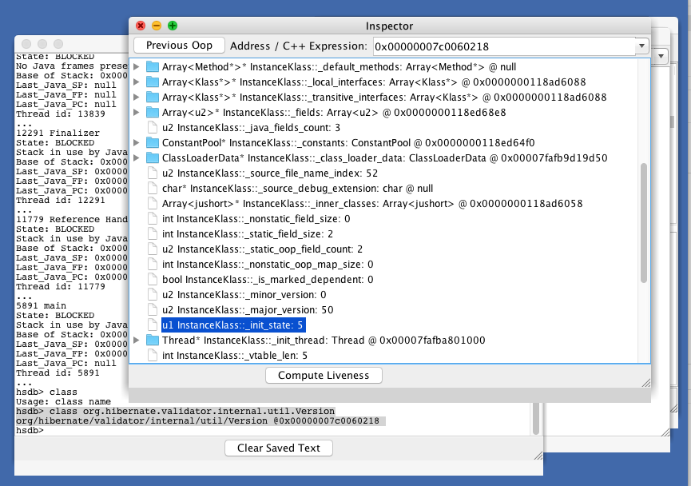

## 问题


最近排查一个spring boot应用抛出hibernate.validator NoClassDefFoundError的问题，异常信息如下：

```
Caused by: java.lang.NoClassDefFoundError: Could not initialize class org.hibernate.validator.internal.engine.ConfigurationImpl
	at org.hibernate.validator.HibernateValidator.createGenericConfiguration(HibernateValidator.java:33) ~[hibernate-validator-5.3.5.Final.jar:5.3.5.Final]
	at javax.validation.Validation$GenericBootstrapImpl.configure(Validation.java:276) ~[validation-api-1.1.0.Final.jar:na]
	at org.springframework.boot.validation.MessageInterpolatorFactory.getObject(MessageInterpolatorFactory.java:53) ~[spring-boot-1.5.3.RELEASE.jar:1.5.3.RELEASE]
	at org.springframework.boot.autoconfigure.validation.DefaultValidatorConfiguration.defaultValidator(DefaultValidatorConfiguration.java:43) ~[spring-boot-autoconfigure-1.5.3.RELEASE.jar:1.5.3.RELEASE]
	at sun.reflect.NativeMethodAccessorImpl.invoke0(Native Method) ~[na:1.8.0_112]
	at sun.reflect.NativeMethodAccessorImpl.invoke(NativeMethodAccessorImpl.java:62) ~[na:1.8.0_112]
	at sun.reflect.DelegatingMethodAccessorImpl.invoke(DelegatingMethodAccessorImpl.java:43) ~[na:1.8.0_112]
	at java.lang.reflect.Method.invoke(Method.java:498) ~[na:1.8.0_112]
	at org.springframework.beans.factory.support.SimpleInstantiationStrategy.instantiate(SimpleInstantiationStrategy.java:162) ~[spring-beans-4.3.8.RELEASE.jar:4.3.8.RELEASE]
	... 32 common frames omitted
```

这个错误信息表面上是`NoClassDefFoundError`，但是实际上`ConfigurationImpl`这个类是在`hibernate-validator-5.3.5.Final.jar`里的，不应该出现找不到类的情况。

那为什么应用里抛出这个`NoClassDefFoundError` ？

有经验的开发人员从`Could not initialize class` 这个信息就可以知道，实际上是一个类在初始化时抛出的异常，比如static的静态代码块，或者static字段初始化的异常。

## 谁初始化了 org.hibernate.validator.internal.engine.ConfigurationImpl

但是当我们在`HibernateValidator` 这个类，创建`ConfigurationImpl`的代码块里打断点时，发现有两个线程触发了断点：

```java
public class HibernateValidator implements ValidationProvider<HibernateValidatorConfiguration> {
	@Override
	public Configuration<?> createGenericConfiguration(BootstrapState state) {
		return new ConfigurationImpl( state );
	}
```

其中一个线程的调用栈是：

```java
Thread [background-preinit] (Class load: ConfigurationImpl)
	HibernateValidator.createGenericConfiguration(BootstrapState) line: 33
	Validation$GenericBootstrapImpl.configure() line: 276
	BackgroundPreinitializer$ValidationInitializer.run() line: 107
	BackgroundPreinitializer$1.runSafely(Runnable) line: 59
	BackgroundPreinitializer$1.run() line: 52
	Thread.run() line: 745
```

另外一个线程调用栈是：

```java
Thread [main] (Suspended (breakpoint at line 33 in HibernateValidator))
	owns: ConcurrentHashMap<K,V>  (id=52)
	owns: Object  (id=53)
	HibernateValidator.createGenericConfiguration(BootstrapState) line: 33
	Validation$GenericBootstrapImpl.configure() line: 276
	MessageInterpolatorFactory.getObject() line: 53
	DefaultValidatorConfiguration.defaultValidator() line: 43
	NativeMethodAccessorImpl.invoke0(Method, Object, Object[]) line: not available [native method]
	NativeMethodAccessorImpl.invoke(Object, Object[]) line: 62
	DelegatingMethodAccessorImpl.invoke(Object, Object[]) line: 43
	Method.invoke(Object, Object...) line: 498
	CglibSubclassingInstantiationStrategy(SimpleInstantiationStrategy).instantiate(RootBeanDefinition, String, BeanFactory, Object, Method, Object...) line: 162
	ConstructorResolver.instantiateUsingFactoryMethod(String, RootBeanDefinition, Object[]) line: 588
	DefaultListableBeanFactory(AbstractAutowireCapableBeanFactory).instantiateUsingFactoryMethod(String, RootBeanDefinition, Object[]) line: 1173
```

显然，这个线程的调用栈是常见的spring的初始化过程。

### BackgroundPreinitializer 做了什么

那么重点来看下 `BackgroundPreinitializer` 线程做了哪些事情：

```java
@Order(LoggingApplicationListener.DEFAULT_ORDER + 1)
public class BackgroundPreinitializer
		implements ApplicationListener<ApplicationEnvironmentPreparedEvent> {

	@Override
	public void onApplicationEvent(ApplicationEnvironmentPreparedEvent event) {
		try {
			Thread thread = new Thread(new Runnable() {

				@Override
				public void run() {
					runSafely(new MessageConverterInitializer());
					runSafely(new MBeanFactoryInitializer());
					runSafely(new ValidationInitializer());
					runSafely(new JacksonInitializer());
					runSafely(new ConversionServiceInitializer());
				}

				public void runSafely(Runnable runnable) {
					try {
						runnable.run();
					}
					catch (Throwable ex) {
						// Ignore
					}
				}

			}, "background-preinit");
			thread.start();
		}
```

可以看到`BackgroundPreinitializer`类是spring boot为了加速应用的初始化，以一个独立的线程来加载hibernate validator这些组件。

这个 `background-preinit` 线程会吞掉所有的异常。

显然`ConfigurationImpl` 初始化的异常也被吞掉了，那么如何才能获取到最原始的信息？

### 获取到最原始的异常信息

在`BackgroundPreinitializer`的 `run()` 函数里打一个断点（注意是`Suspend thread`类型, 不是`Suspend VM`），让它先不要触发`ConfigurationImpl`的加载，让spring boot的正常流程去触发`ConfigurationImpl`的加载，就可以知道具体的信息了。

那么打出来的异常信息是：

```java
Caused by: java.lang.NoSuchMethodError: org.jboss.logging.Logger.getMessageLogger(Ljava/lang/Class;Ljava/lang/String;)Ljava/lang/Object;
	at org.hibernate.validator.internal.util.logging.LoggerFactory.make(LoggerFactory.java:19) ~[hibernate-validator-5.3.5.Final.jar:5.3.5.Final]
	at org.hibernate.validator.internal.util.Version.<clinit>(Version.java:22) ~[hibernate-validator-5.3.5.Final.jar:5.3.5.Final]
	at org.hibernate.validator.internal.engine.ConfigurationImpl.<clinit>(ConfigurationImpl.java:71) ~[hibernate-validator-5.3.5.Final.jar:5.3.5.Final]
	at org.hibernate.validator.HibernateValidator.createGenericConfiguration(HibernateValidator.java:33) ~[hibernate-validator-5.3.5.Final.jar:5.3.5.Final]
	at javax.validation.Validation$GenericBootstrapImpl.configure(Validation.java:276) ~[validation-api-1.1.0.Final.jar:na]
	at org.springframework.boot.validation.MessageInterpolatorFactory.getObject(MessageInterpolatorFactory.java:53) ~[spring-boot-1.5.3.RELEASE.jar:1.5.3.RELEASE]
```

那么可以看出是 `org.jboss.logging.Logger` 这个类不兼容，少了`getMessageLogger(Ljava/lang/Class;Ljava/lang/String;)Ljava/lang/Object` 这个函数。

那么检查下应用的依赖，可以发现`org.jboss.logging.Logger` 在`jboss-common-1.2.1.GA.jar`和`jboss-logging-3.3.1.Final.jar`里都有。

显然是`jboss-common-1.2.1.GA.jar` 这个依赖过时了，需要排除掉。

### 总结异常的发生流程

0. 应用依赖了`jboss-common-1.2.1.GA.jar`，它里面的`org.jboss.logging.Logger`太老
0. spring boot启动时，`BackgroundPreinitializer`里的线程去尝试加载`ConfigurationImpl`，然后触发了`org.jboss.logging.Logger`的函数执行问题
0. `BackgroundPreinitializer` 吃掉了异常信息，jvm把`ConfigurationImpl`标记为不可用的
0. spring boot正常的流程去加载`ConfigurationImpl`，jvm发现`ConfigurationImpl`类是不可用，直接抛出`NoClassDefFoundError`

    ```
    Caused by: java.lang.NoClassDefFoundError: Could not initialize class org.hibernate.validator.internal.engine.ConfigurationImpl
    ````

## 深入JVM

为什么第二次尝试加载`ConfigurationImpl`时，会直接抛出`java.lang.NoClassDefFoundError: Could not initialize class` ？

下面用一段简单的代码来重现这个问题：

```java
try {
  org.hibernate.validator.internal.util.Version.touch();
} catch (Throwable e) {
  e.printStackTrace();
}
System.in.read();

try {
  org.hibernate.validator.internal.util.Version.touch();
} catch (Throwable e) {
  e.printStackTrace();
}
```

### 使用HSDB来确定类的状态

当抛出第一个异常时，尝试用HSDB来看下这个类的状态。

```
sudo java -classpath "$JAVA_HOME/lib/sa-jdi.jar" sun.jvm.hotspot.HSDB
```

然后在HSDB console里查找到`Version`的地址信息

```
hsdb> class org.hibernate.validator.internal.util.Version
org/hibernate/validator/internal/util/Version @0x00000007c0060218
```

然后在`Inspector`查找到这个地址，发现`_init_state`是5。



再看下hotspot代码，可以发现5对应的定义是`initialization_error`：

```cpp
// /hotspot/src/share/vm/oops/instanceKlass.hpp
// See "The Java Virtual Machine Specification" section 2.16.2-5 for a detailed description
// of the class loading & initialization procedure, and the use of the states.
enum ClassState {
  allocated,                          // allocated (but not yet linked)
  loaded,                             // loaded and inserted in class hierarchy (but not linked yet)
  linked,                             // successfully linked/verified (but not initialized yet)
  being_initialized,                  // currently running class initializer
  fully_initialized,                  // initialized (successfull final state)
  initialization_error                // error happened during initialization
};
```

### JVM规范里关于Initialization的内容

http://docs.oracle.com/javase/specs/jvms/se7/html/jvms-5.html#jvms-5.5


从规范里可以看到初始一个类/接口有12步，比较重要的两步都用黑体标记出来了：

* 5: If the Class object for C is in an erroneous state, then initialization is not possible. Release LC and throw a NoClassDefFoundError.

* 11: Otherwise, the class or interface initialization method must have completed abruptly by throwing some exception E. If the class of E is not Error or one of its subclasses, then create a new instance of the class ExceptionInInitializerError with E as the argument, and use this object in place of E in the following step.

### 第一次尝试加载Version类时

当第一次尝试加载时，hotspot InterpreterRuntime在解析`invokestatic`指令时，尝试加载`org.hibernate.validator.internal.util.Version`类，`InstanceKlass`的`_init_state`先是标记为`being_initialized`，然后当加载失败时，被标记为`initialization_error`。

对应`Initialization`的11步。

```cpp
// hotspot/src/share/vm/oops/instanceKlass.cpp
// Step 10 and 11
Handle e(THREAD, PENDING_EXCEPTION);
CLEAR_PENDING_EXCEPTION;
// JVMTI has already reported the pending exception
// JVMTI internal flag reset is needed in order to report ExceptionInInitializerError
JvmtiExport::clear_detected_exception((JavaThread*)THREAD);
{
  EXCEPTION_MARK;
  this_oop->set_initialization_state_and_notify(initialization_error, THREAD);
  CLEAR_PENDING_EXCEPTION;   // ignore any exception thrown, class initialization error is thrown below
  // JVMTI has already reported the pending exception
  // JVMTI internal flag reset is needed in order to report ExceptionInInitializerError
  JvmtiExport::clear_detected_exception((JavaThread*)THREAD);
}
DTRACE_CLASSINIT_PROBE_WAIT(error, InstanceKlass::cast(this_oop()), -1,wait);
if (e->is_a(SystemDictionary::Error_klass())) {
  THROW_OOP(e());
} else {
  JavaCallArguments args(e);
  THROW_ARG(vmSymbols::java_lang_ExceptionInInitializerError(),
            vmSymbols::throwable_void_signature(),
            &args);
}
```

### 第二次尝试加载Version类时

当第二次尝试加载时，检查`InstanceKlass`的`_init_state`是`initialization_error`，则直接抛出`NoClassDefFoundError: Could not initialize class `.

对应`Initialization`的5步。


```cpp
// hotspot/src/share/vm/oops/instanceKlass.cpp
void InstanceKlass::initialize_impl(instanceKlassHandle this_oop, TRAPS) {
// ...
    // Step 5
    if (this_oop->is_in_error_state()) {
      DTRACE_CLASSINIT_PROBE_WAIT(erroneous, InstanceKlass::cast(this_oop()), -1,wait);
      ResourceMark rm(THREAD);
      const char* desc = "Could not initialize class ";
      const char* className = this_oop->external_name();
      size_t msglen = strlen(desc) + strlen(className) + 1;
      char* message = NEW_RESOURCE_ARRAY(char, msglen);
      if (NULL == message) {
        // Out of memory: can't create detailed error message
        THROW_MSG(vmSymbols::java_lang_NoClassDefFoundError(), className);
      } else {
        jio_snprintf(message, msglen, "%s%s", desc, className);
        THROW_MSG(vmSymbols::java_lang_NoClassDefFoundError(), message);
      }
    }
```


## 总结

* spring boot在`BackgroundPreinitializer`类里用一个独立的线程来加载validator，并吃掉了原始异常
* 第一次加载失败的类，在jvm里会被标记为`initialization_error`，再次加载时会直接抛出`NoClassDefFoundError: Could not initialize class `
* 当在代码里吞掉异常时要谨慎，否则排查问题带来很大的困难
* http://docs.oracle.com/javase/specs/jvms/se7/html/jvms-5.html#jvms-5.5
